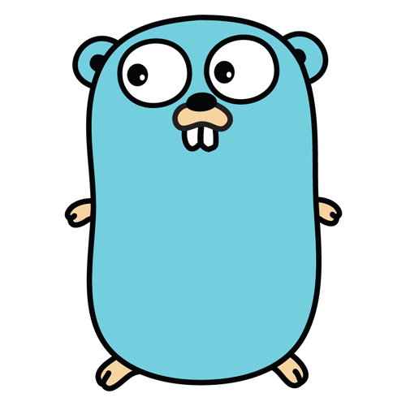

### <h1>datnd </h1>👋

Hi, I'm Adam (datnd). I'm from Vietnam. I study in **University of Science - Ho Chi Minh National University**. I'm looking for a **web developer position.**

<h2>Profile</h2>

- **My target**: A professional web developer.
- **Hobbies**: Boardgames, Reading, Communication.
- **Travel place in the future**: Japan, Korea, China, Singapore, USA
- **Charecteristic**: Funny, self-reliant, confident, etc.
- :envelope: gmail: nddat1811@gmail.com

# <h4>Another platform </h4>

<h2>Experience</h2>

<table>
    <tbody>
        <tr>
            <td>:capital_abcd: <code>Languages</code></td>
            <td>
                
                &nbsp;
                
                &nbsp;
                
               &nbsp;
              
            </td>
        </tr>
        <tr>
            <td>:package: <code>Database</code></td>
            <td>
                
                &nbsp;
                
                &nbsp;
                
            </td>
        </tr>
        <tr>
            <td>:arrows_clockwise: <code>CI/CD</code></td>
            <td>
                
                <!-- &nbsp;
                 -->
                &nbsp;
                
            </td>
        </tr>
        <tr>
            <td>:open_file_folder: <code>SCM</code></td>
            <td>
                
            </td>
        </tr>
        <tr>
            <td>:computer: <code>Text Editor</code></td>
            <td>
                
            </td>
        </tr>
        <tr>
            <td>:art: <code>Design</code></td>
            <td>
                
                &nbsp;
            </td>
        </tr>
        <tr>
            <td>:handshake: <code>Collaboration</code></td>
            <td>
                <!-- Source: https://atlassian.design/resources/logo-library -->
                
                &nbsp;
                
                <!-- Source: https://atlassian.design/resources/logo-library -->
                
            </td>
        </tr>
    </tbody>
</table>

<!--
<picture>
 <source media="(prefers-color-scheme: dark)" srcset="https://i.pinimg.com/736x/56/86/03/568603cbd1860c67bf8f6776cbe7f885.jpg">
 <source media="(prefers-color-scheme: light)" srcset="https://i.pinimg.com/736x/56/86/03/568603cbd1860c67bf8f6776cbe7f885.jpg">
 
</picture>
-->
<!--
**nddat1811/nddat1811** is a ✨ _special_ ✨ repository because its `README.md` (this file) appears on your GitHub profile.

Here are some ideas to get you started:

- 🔭 I’m currently working on ...
- 🌱 I’m currently learning ...
- 👯 I’m looking to collaborate on ...
- 🤔 I’m looking for help with ...
- 💬 Ask me about ...
- 📫 How to reach me: ...
- 😄 Pronouns: ...
- ⚡ Fun fact: ...
-->
